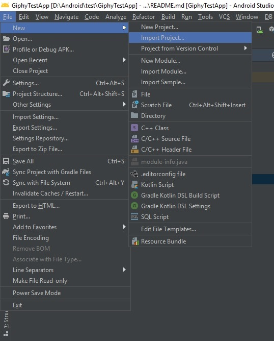
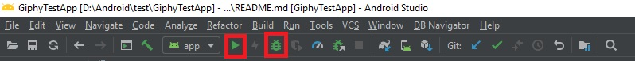

# Инструкция по сборке и запуску проекта

Для запуска проекта необходима Android Studio версии 3.3 и выше. Скачать можно вот здесь
[Android Studio](https://developer.android.com/studio/preview).
После скачиваня необходимо распаковать архив и запустить Android Studio

## Импорт в проекта

Прежде всего необходимо импортировать проект в Android Studio. Для этого необходимо выбрать
`File->New->Import Project`.

В открывшемся окне необходимо выбрать папку в которую, предварительно, был склонировать проект
После импорта будет автоматически запущен процесс скачивания зависимостей и синхронизации проекта.
В процессе синхронизации Android Studio может предложить перейти на более новую версию gradle-плагина,
в этом случае необходимо отказаться от обновления

## Запуск проекта

После успешной синхронизации, проект можно запустить воспользовавшись или реальным устройством или эмулятором.
О том как работать с эмулятором можно почитать в инструкции на сайте [developer.android.com](https://developer.android.com/studio/run/emulator).
Для запуска проекта необходимо выбрать пункт меню `Run->Run` или `Run->Debug` в зависимости от того в каком режиме Вы хотите запустить приложение.
Так же для запуска можно воспользоваться кнопками `Debug` или `Run` на тулбаре как показано на изображении ниже. 

После этого начнется сборка проекта, установка на устройство и запуск.

